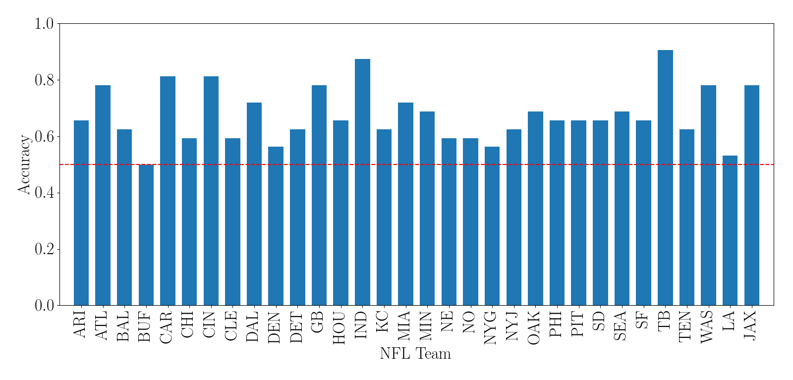

# Abstract
In this project I train support vector machines (SVMs) to predict if a National Football League (NFL) team will be leading at the half or not, given the results of the first quarter. For each team, I train a SVM using the optimal hyperparameters and features for prediction. The results show that the optimal classifying model for each team is, on average, 17.6% better than flipping a coin.

# Background
I like football. A lot of America likes football- in fact gridiron football is the most watched sport in America. I was also tasked with answering a problem using the machine learning techniques in one of my ICS class. So I figured, why not combine the two?

The NFL (as with most sports) can be pretty unpredictable at times, which leads to many fans (such as myself) making dumb bets based on the outcome of the game. At the end of the 1st quarter or the half of an NFL game with my friends, we typically ask each other who will lead in the following quarters and make friendly bets from here. Let’s call it inspirtation, which led me to ask the following question after losing one of these bets:

Given information about teams before the start of the second quarter, can we accurately predict if they will lead at the half?”

A question immediately following the above, should be “What should we measure?”. With so many variables in play, it’s near-to-impossible to find the correct answer. The approach I used here was to look at the team’s performance in offense, defense, and special teams.

Football teams are traditionally divided into three “platoons”: offense, defense, and special teams. The players on offense focus on driving the football down the field, earning points if they move the ball to the opposing end-zone. The goal of the defense is to prevent the other team from scoring. Special teams come in to play when a team wants to kick the ball through the opponent’s goal, or as far as they can to the other side for the opponents to get. It makes sense that the better a team performs in these areas, the probability that this team will take the lead increases.

# Feature Selection 
This project uses the 2009 to 2016 play-by-play data-set compiled by the Carnegie Mellon Sports Analytics Club. If we treat each first quarter of a regular season game (ignoring pre-season and post-season) as one data point for each team, we get: N = 128 _points per team_.

Following the 50:25:25 rule for splitting our data-set into training, verification, and testing sets, we get N = 64 points for training. There are over 100 features per play in our data-set, which means we need to restrict the information we convey. An arbitrary maximum of d = sqrt(N) = 8 features per set was chosen as this restriction. The four feature sets I looked at were:

1. **Offense Focused**, d = 8
    1. Average distance to go for first down.
    2. Total number of goal down situations.
    3. Total number of first down conversions.
    4. Average yards gained per play.
    5. Total number of touchdowns.
    6. Total number of pass plays.
    7. Total number of run plays.
    8. Total number of complete passes.
2. **Defense Focused**, d = 6
    1. Total number of quarterback hits.
    2. Total number of safeties.
    3. Total number of incomplete passes on opposing team.
    4. Total number of interceptions thrown by opposing team.
    5. Total number of fumbles by other team.
    6. Total number of sacks.
3. **Special Teams Focused**, d = 8
    1. Total number of extra points made.
    2. Total number of extra points missed by opposing team.
    3. Total number of extra points blocked.
    4. Total number of two point conversions.
    5. Total number of two point failures by opposing team.
    6. Total number of field goals.
    7. Total number of field goals blocked.
    8. Average field goal distance.
4. **Overall Performance**, d = 8
    1. Total number of first downs.
    2. Total number of touchdowns.
    3. Total number of interceptions thrown by opposing team.
    4. Total number of fumbles by opposing team.
    5. Total number of sacks.
    6. Total number of field goals made.
    7. Is the team leading after the first quarter?
    8. Does the team start with the ball in the 2nd quarter?

It is important to note that the selection of these feature ignores the other team’s performance (directly), the changes made over the years, weather of this game, and much more. These factors go beyond the scope of this project, but are important to be aware of.

# Methods
This is a binary classification problem, whose labels [ell\_1, ell\_2] represent ell\_1 = leading at the half and ell\_2 = not leading at the half. To solve this classification problem, I used SKLearn’s support vector machines.

Considering that each team is different, I wanted to tailor my models to each team. There are 32 teams in the NFL, which means our goal is to find 32 different models. There are three parameters I am testing: the features, the c SVM parameter, and the gamma SVM parameter. The radial basis function kernel was used for all SVMs. The spaces each parameter existed in are listed below:

- Features: Offense Focused, Defense Focused, Special Teams Focused, Overall Performance
- c SVM Parameter: 0.5, 1, 10, 100, 1000
- gamma SVM Parameter: 0.0001, 0.001, 0.01, 0.1

o train each model, I used all games whose week number was in the space [1, 3, 5, 7, 9, 11, 13, 15] (the odd weeks). This gives us 50% of our entire data-set (N = 64 per team) to train with, and avoids any patterns that may emerge by only choosing the early or late weeks.

After training our array of models, we need to determine which model is the best for each team. For all models belonging to a team, we predict the lead of games that don’t belong to our training data-set. This new data-set consists of games whose week number was 2, 6, 10, or 14, giving us N = 32 points per team to verify with. The best model with the most optimal hyperparameters c and gamma, as well as the optimal feature set were found using a grid search (iterating through each combination of c, gamma, and our feature set). This model would then be chosen for our testing phase.

To test how accurate our final models are for each team, we predict the lead of games that don’t belong to our previous data-sets. This new data-set consists of games whose week number was 4, 8, 12, or 16, giving us N = 32 points per team to test with. The results of these trials are given below.

# Results

## Verification Data Summary

- c Parameter
	- 25% of best models use c = 0.5.
	- 6% of best models use c = 1.
	- 31% of best models use c = 10.
	- 10% of best models use c = 100.
	- 28% of best models use c = 1000.
- gamma Parameter
	- 5% of best models use gamma = 0.0001.
	- 13% of best models use gamma = 0.001.
	- 3% of best models use gamma = 0.01.
	- 13% of best models use gamma = 0.1.
	- 66% of best models use gamma = 1.
- Feature Set
	- 18% of best models use offense focused features.
	- 13% of best models use defense focused features.
	- 16% of best models use special team’s focused features.
	- 53% of best models use the overall performance features.
	
## Testing Data

- On average, each model was (0.676 ± 0.097) × 100% accurate.
- The most accurate model belongs to the Tampa Bay Buccaneers (TB), who used c = 1, gamma = 0.1, and the overall performance feature set.
- The least accurate model belongs to the Buffalo Bills (BUF), who used c = 1, gamma = 1, and the defense feature set.

## Discussion
Most of the best models use c = 1000 and gamma = 1, the highest of each parameter we tested. We might be able to increase our model accuracy by looking at even higher values for c and gamma here. It is interesting to note that over half of our models use the overall performance feature set. This shows how every “platoon” in football matters, and how we need to look at all aspects of the game to answer our original question.

For a more involved project, I would have considered more data-sets. It’s a common assumption that teams play different in weather that is different from their home city, so I could include weather features. Maybe the people in attendance is a factor as well, and we could include the number of tickets sold as another feature. The week number itself could also be a feature as teams will play differently if they are fighting for a playoff spot, as opposed to the teams who have been eliminated from playoff contention.

Overall, most of these models are okay. These aren’t the holy grail of determining half time leads, but most of them are better than flipping a coin and guessing. That shows that the selected features for each team are worth considering, but there’s work to be done in testing even more feature sets.
